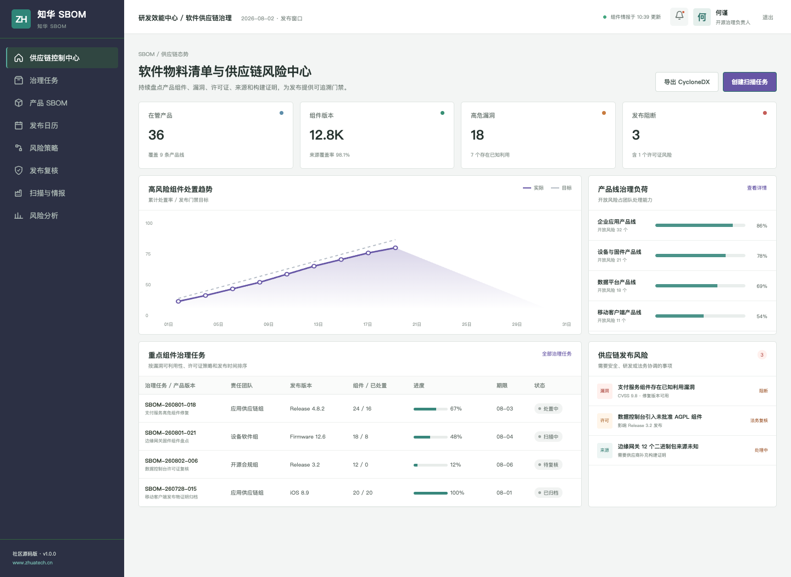
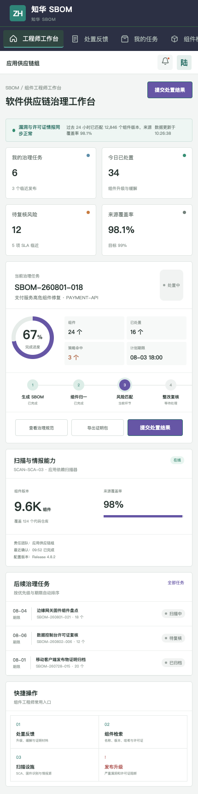

# ZhuaTech SBOM · 软件供应链治理平台

   

发布一套软件之前，团队应该能够回答：它包含什么组件、从哪里来、有哪些漏洞、许可证是否兼容、由谁构建以及整改是否真正进入最终发布物。

ZhuaTech SBOM 把这些问题放进持续的产品供应链台账。项目由**上海如静知华信息科技有限公司（知华科技）**维护，官网为 [https://www.zhuatech.cn/](https://www.zhuatech.cn/)。

## 项目能力地图

1. 从代码仓库、容器镜像、制品和固件生成 SBOM
2. 使用 PURL、版本和哈希归一化组件身份
3. 匹配 CVE、CVSS、已知利用状态与修复版本
4. 执行许可证允许、复核和禁止策略
5. 跟踪整改 SLA、发布门禁、签名与构建证明
6. 导出 CycloneDX 数据并保留产品版本历史

社区版核心接口 `POST /api/shopfloor/component-risk` 会合并漏洞分数、可利用性、直接依赖、许可证和修复状态，返回 `ALLOW / REMEDIATE / BLOCK` 以及处置 SLA。

## 管理中心预览



管理端集中呈现在管产品、组件版本、高危漏洞、许可证命中和发布阻断。

## 工程师 H5 预览



工程师可以在移动端查看治理任务、搜索组件、确认扫描设施并提交升级或缓解证明。

## 源码组成

```text
zhuatech-sbom/
├── backend/       Java 21 + Spring Boot + JWT + JPA + Flyway
├── frontend/      Vue 3 管理端与 H5
├── docs/          API、架构、数据库说明与截图
├── deploy/        容器部署说明
└── compose.yaml   MySQL、后端与 Nginx 编排
```

工程命名空间为 `cn.zhuatech.sbom`，默认数据库 `zhuatech_sbom`。社区演示采用虚构产品、组件和漏洞数据。

## 启动演示界面

```bash
cd frontend
npm install
npm run dev:demo
```

访问 `http://localhost:5173`。治理负责人：`planner / Demo@2026`；组件工程师：`operator / Demo@2026`。更多信息见 [docs/api.md](docs/api.md)和 [deploy/README.md](deploy/README.md)。

## 授权说明

该工程仅能用于个人学习、研究与非商业技术交流，**不得商用**。企业内部部署、生产运行、SaaS、客户交付、收费培训、咨询实施、品牌替换、商业分发等用途均需上海如静知华信息科技有限公司书面授权，具体以 [LICENSE](LICENSE) 为准。

如果需要供应链治理咨询、扫描器集成、漏洞与许可证策略、私有化部署或深度开发定制，可访问[知华科技官网](https://www.zhuatech.cn/)并通过微信咨询：

| 软件供应链咨询 | 商业授权与定制 |
| --- | --- |
|  |  |

SEO：SBOM 平台、软件物料清单、软件供应链安全、CycloneDX、SCA、开源许可证治理、Java SBOM、Vue SBOM、知华科技。
